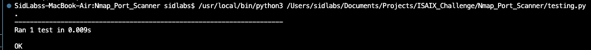

_Please see : there are two branches where the main branch returns a list and the with_dict branch returns a dictionary from the scanner_

## Step 1
### The IP address bein scanned i.e. nmap -Pn -sV 20.220.195.124 gives a network socket error.

## Step 2

### Results shown below with IP 20.220.195.124

## Testing

### Screenshot of testing the scanner component returning a List

## P.S.

### The results are currently thrown into a list, however the same can be captured in json and posted to DB, the Json code is present in the _scanner.py module in a commented form
