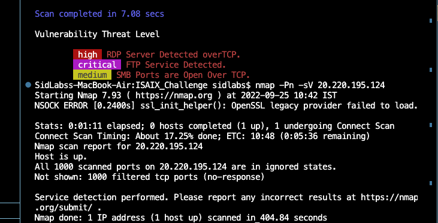
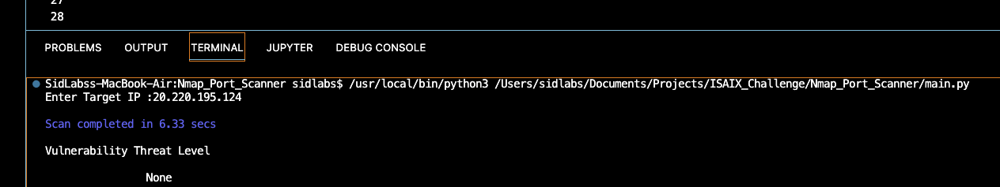

## Step 1
### The IP address bein scanned i.e. nmap -Pn -sV 20.220.195.124 gives a network socket error.

## Step 2

### Results shown below with google static IP 8.8.8.8

## P.S.

### The results are currently thrown into a list, however the same can be captured in json and posted to DB, the Json code is present in the _scanner.py module in a commented form